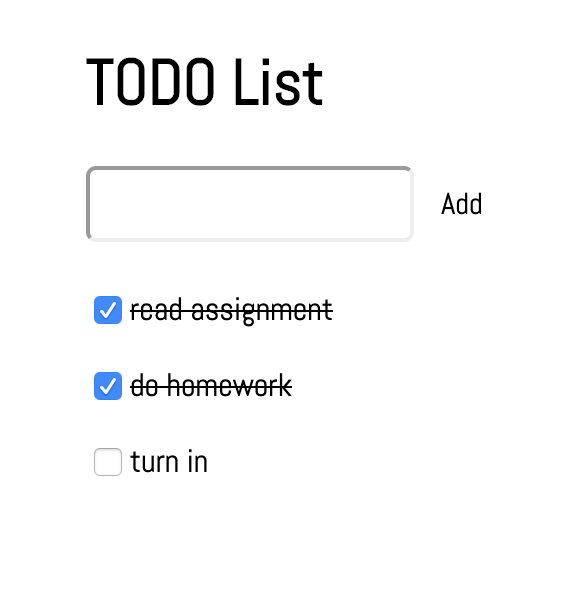

# WATS 3020 DOM 1

## Introduction

This assignment has been developed to give you an opportunity to work with DOM manipulation and Events in JavaScript. Here, you will use JavaScript to manipulate HTML elements, dynamically changing the page as the user interacts with it. This will be accomplished by making a basic To-Do list.

* `1-todo-vanilla`: a basic To-Do list built with HTML, CSS, and "vanilla" JavaScript.
* `2-todo-jquery`: a basic To-Do list built with HTML, CSS, JavaScript, and JQuery.
* `3-list`: the same list from part 1 or 2, but with added features.

In Parts 1 and 2, you will be building the same To-Do list but using different methods. The first version will only use "vanilla" JavaScript, which means only JavaScript defined in the by the ECMAScript Standard. The second version will use JQuery, a popular JavaScript library that was created to make DOM manipulation easier.

### Features of the TODO list
* User enters an activity and presses the button or enter key to add to list
* User clicks the check box to cross out an item when its complete
* Checkbox acts as a toggle so that if it is already checked, clicking it will un-check it

### Final Display
The Final Display is the same for both the #1 & #2 To-Do lists, even though #1 is created with Vanilla JS only and #2 uses jQuery.

## Topics covered by this Assignment:
* [MDN Vanilla JavaScript](https://developer.mozilla.org/en-US/docs/Web/JavaScript)
* [jQuery documentation](https://api.jquery.com/)
  * [jQuery method, abbreviated as $](https://api.jquery.com/jQuery/)
  * [jQuery object](https://api.jquery.com/Types/#jQuery)
  * [jQuery .ready() method](https://api.jquery.com/ready/)
  * [jQuery .submit() method](https://api.jquery.com/submit/)
  * [jQuery Attribute Equals Selector](https://api.jquery.com/attribute-equals-selector/)
  * [jQuery .change() method](https://api.jquery.com/change/)
* [MDN Script element](https://developer.mozilla.org/en-US/docs/Web/HTML/Element/script)
* [MDN JavaScript Events](https://developer.mozilla.org/en-US/docs/Web/Events)
* [W3 Schools document](https://www.w3schools.com/js/js_htmldom_document.asp)
* [MDN Form Element Reference](https://developer.mozilla.org/en-US/docs/Web/HTML/Element#Forms)
* [How HTML Forms Work](http://javascript-coder.com/html-form/html-form-tutorial-p1.phtml)

Read more about these topics in the local file [reference.md](reference.md).

## Basic Requirements
In order to complete this project successfully, you will need to fulfill these requirements:
* Complete all of the TODO requirements in the `index.js` file of the `1-todo-vanilla` web page using ECMAScript standard JavaScript.
* Complete all of the TODO requirements in the `index.js` file of the `2-todo-jquery` web page using the JQuery JavaScript library.
* Note: for both `1-todo-vanilla` and `2-todo-jquery`, you will not be required to make any changes to the files `index.html` or `style.css`.
* Using either your `1-todo-vanilla` or `2-todo-jquery` pages as a starting point, copy the files to the `3-list` folder and modify the code such that when you click on the list to indicate done, the item moves to a seprate "Done" list that you'll add to your HTML.  The "Done" list doesn't need to be in the form as it will not change. You can do this using "vanilla" JavaScript or JQuery. 

## Guide & Tutorial
For assistance on how to proceed with specific components of the assignment, consult this [text tutorial](./tutorials.md) for guidance. In the alternative, a video walkthrough of the assignment can be found here: **link**.

## Stretch Goals
1. Complete `3-list` with both ECMAScript standard JavaScript and the JQuery JavaScript library.
2. Add different styling to the elements on the Done list in `3-list`.