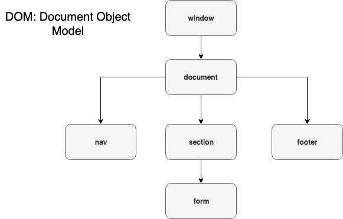

# WATS 3020: Document Object Model 1

### **Walkthrough Video**
[DOM-1](https://www.youtube.com/watch?v=YY3waj6AADg)
***

## Dynamic HTML and CSS: Using Vanilla JavaScript and jQuery

## The DOM: Document Object Model
DOM is an acronym for **Document Object Model**.  The DOM is a hierarchical model with the **window** object at the root, followed by the **document** object.  Within the **document** object are the renderable objects such as **paragraphs**, **sections**, and all the elements that can be coded with HTML tags.  Nesting these objects creates a deeper hierarchy.  

Because all of these elements are available to use as objects, we can programatically interact with them and we use JavaScript to do that.
<div>

</div>


## Vanilla JavaScript vs jQuery
The term "Vanilla JavaScript" refers to JavaScript as it is defined by the [ECMAscript](https://en.wikipedia.org/wiki/ECMAScript) organization.  This organization defines the spec that browser developers use to implement JavaScript in their browser product.  Not all browsers have implemented all of the specs.  You can use a website like [Can I Use](https://caniuse.com/) to see if a particular JavaScript feature is implemented in a browser you support.

jQuery is a library that was created created to simplify working with the DOM.  We learn to work with it in this course because it is still is wide use.  For example Bootstrap 4 uses jQuery to implement it's components.

As you work on the exercises in this assignment, compare jQuery syntax with Vanilla JS.  jQuery provides and overloaded function that is aliased with `$`.  When you see `$` think of a function called jQuery that takes as its arguments a string containing a CSS selector.  The result of calling that function is to turn the elements selected into an array of element objects or a single object.  The jQuery call in the code below will return all list items with the class contact.  The items will be returned as an array even if there is only one.
```JavaScript
let listElement = $('li.contact')
```

When using Vanilla JS, you'll use `document.querySelector` and `document.querySelectorAll` to make a call to return elements as objects.  The `document.querySelector` will return just 1 object, and if there are multiple elements that match the selector, only the first will be returned. If no elements are found `document.querySelector` returns null. If you call `document.querySelectorAll`, you will get an array of objects even if the selector only finds 1, and will return an empty array if none are found. 

The fact that both jQuery and Vanilla JS rely on a function that selects elements in the DOM and returns objects with functions that can be call on them is what makes them the same. 

In order to use jQuery you must import the jQuery library into your HTML page while Vanilla JS is available on any browser.  

Note: You can mix Vanilla JS and jQuery in your code.  In general, I would choose to code in Vanilla JS, but you will find jQuery in use so its good to be able to recognize it and use it.

## HTML Must Render Before Creating Objects!
When we make a call like the following
```JavaScript 
let el = document.querySelector("#list")
```
`el` will be undefined even if a tag with `id="list"` exists in the HTML - if the browser has not rendered it to the page before the JavaScript its executed.  That's why you'll see the `<script>` tag coded after the other render-able tags.

Placing the script tag just above the `<body>` tag does not always provide enough time to guarantee all elements are rendered.  For that reason, we can rely up an event that is fired by the browser to let us know the the DOM is ready and all elements are rendered.
In Vanilla JS, we wrap all of our code in a function that is run when the DOM content is loaded.
```JavaScript
document.addEventListener("DOMContentLoaded", event => {
  //work with DOM here
})
```
In jQuery we wrap our code in a call to the `ready` function.
```JavaScript
$(document).ready(event => {
  //work with DOM here
})
```

## User experience of a Web Page

Web pages serve as interactive graphical user interfaces (GUIs).  Because GUI's are interactive, we process events that are generated by the user.  We'll see in a future assignment how the web page can respond to non-user events such as requested data being returned from the internet.  

The simplest event to consider is the user clicking on a button.  In this assignment, we'll use JavaScript to allow a user to build up a list by entering data into an input field and clicking on a button. The list will be updated on the page as the user enter data.   

## Events and Event Handlers
There are many events that can be detected and acted on in the browser.  The code that processes an event is often referred to as a "handler".  The handler is a JavaScript function which by default receives and event argument.  The code below shows setting up a `click` handler using Vanilla JavaScript.  Familiarize yourself with this pattern of detecting an event and calling a function to "do something" in response.
```JavaScript
document.addEventListener("click", function(event) => {
  console.log("event handled")
}
```
In the code above we added a "listener" to the document object by calling the `addEventListener` function that is defined for the document object.  The document object is a global object global object made available by the global variable `document`.  

You may also see the listener attached with an arrow function.  Remember that the arrow function changes the scope of what's in the function block.  If you refer to `this` using `function` in your handler, you're accessing the element on which the event occurred, like a button.  If you refer to `this` using an arrow function, and you refer to `this` it will be the `window` objects since that is block you're in.

You can see a demo of the effect on `this` by running the code in **demo-function-vs-arrow** and at the console looking the console.

## Forms
Form are used to collect data.  An HTML element like a button can be programmed to submit a form.  The convention is to provide a name attribute for each element in the form that acts as a an identifier for the data.  Forms were initially designed to submit data to a server, but as JavaScript became the norm a lot of data is handed off to the server via API's, which will look more closely at in a future module.  
A form is created using the `<form></form>` tag and if an element has a `type="submit"` attribute it will fire a `submit` event when clicked.  

## Script tag
In order to use JavaScript in a web page the JavaScript must be added to the HTML file using the `<script>` tag.  It also possible to add JavaScript commands to and HTML file as event handler attributes in an HTML tag, but in this course, and as best practice, its good to separate JavaScript from HTML and the `<script>` tag helps developers to that.

You will generally find the **script** tag at the bottom of the HTML rendered content, just above the body tag.  If you are providing multiple script tags and there is any dependency among them, the order matters.  The dependent code must follow and code that it is dependent on.

The **script** tag can contain JavaScript commands as in the following code snippet:
```HTML
<script>
alert("hello")
</script>
```

It is a best practice to move JavaScript into an external file.  If I have a file in my project with the following path: **js/index.js**, then I can include it in my HTML file using the `src` attribute with the `script` tag.
```HTML
<script src="js/index.js"></script>
```


## Project Resources
* [MDN Vanilla JavaScript](https://developer.mozilla.org/en-US/docs/Web/JavaScript)
* [jQuery](https://jquery.com/)
* [MDN Script element](https://developer.mozilla.org/en-US/docs/Web/HTML/Element/script)
* [MDN JavaScript Events](https://developer.mozilla.org/en-US/docs/Web/Events)
* [W3 Schools document](https://www.w3schools.com/js/js_htmldom_document.asp)
* [MDN Form Element Reference](https://developer.mozilla.org/en-US/docs/Web/HTML/Element#Forms)
* [How HTML Forms Work](http://javascript-coder.com/html-form/html-form-tutorial-p1.phtml)


* * *
## Tutorials
Fork this repository.
Replace TODO's with code that will create a TODO list.  
    

### Features of the TODO list
* User enters an activity and presses the button or enter key to add to list
* User clicks the check box to cross out an item when its complete
* Checkbox acts as a toggle so that if it is already checked, clicking it will un-check it

The Final Display is the same for both the #1 & #2 TODO lists, even though #1 is created with Vanilla JS only and #2 uses jQuery.
**Final Display**
<div>

</div>


**1-todo-vanilla** 
  - TODO add "DOMContentLoaded" event to listen for to signal that DOM is ready to access
  - TODO add event listener to signal that user is submitting form.  You must "wrap" all existing code in this event
  ```JavaScript
  document.addEventListener("submit", event => {
    //all code here
  })
  ```
  - call a function to prevent the click from "bubbling up"
  ```JavaScript
    event.preventDefault()
```
- TODO add a selector that selects the input element with the attribute name equal to "item-input" `"input[name=item-input]"`
- TODO create a list item with a checkbox and a label containing the user input string
```JavaScript
  let newItemEl = document.createElement('li');
  let newCheckBox = document.createElement('input')
  newCheckBox.setAttribute("type", "checkbox")
  newItemEl.appendChild(newCheckBox)
  let newLabel = document.createElement('label')
  newLabel.innerHTML = itemValue
  newItemEl.appendChild(newLabel)
```
- TODO add click event toggle that strikes out text in label associated with list item
```JavaScript
 newCheckBox.addEventListener("click", function (event) {
  if (this.nextSibling.style.textDecoration === "line-through") {
    this.nextSibling.style.textDecoration = ""
  } else {
    this.nextSibling.style.textDecoration = "line-through"
  }
})
```


**2-todo-jquery** 

  - TODO add document ready `$(document).ready`
  - TODO add event listener to signal that user is submitting form.  You must "wrap" all code related to user clicking submit in this event
  ```JavaScript
  $("#todo-form").submit(event => {
    //all code here
  })
  ```
  - call a function to prevent the click from "bubbling up"
  ```JavaScript
    event.preventDefault()
  ```
  - TODO obtain the user input object and string value   
  ```JavaScript
    let itemInput = $($("input[name=item-input]")[0])
    let itemValue = itemInput.val()
  ```
  - TODO create a new list item value with checkbox and label
  ```JavaScript
    let newItemEl = $("<li>")[0]
    let newCheckBox = $('<input type="checkbox" />')[0]
    let newLabel = $(`<label>`).html(itemValue)[0]
    newItemEl.append(newCheckBox, newLabel)
  ``` 
  - TODO set up a checkbox toggle to strike out text when clicked.  Note the difference in how we detect that the checkbox has changed and then whether it was checked or not.
```JavaScript
$(':checkbox').change(function (event) {
    event.preventDefault()
    if ($(this).is(':checked')) {
      $(this).siblings("label").css("text-decoration", "line-through")
    } else {
      $(this).siblings("label").css("text-decoration", "none")
    }
})
```
**3-list** 
  - TODO: For this exercise you must set up HTML/CSS/JavaScript files and write code to create a list.  Once you've completed the lists above, you an use that code to help you do this.  

  - Once you have to current list working, modify the code such that when you click on the list to indicate done, it move the item to a "Done" list that you'll add to your HTML.  The "Done" list doesn't need to be in the form as it will not change. 

  You can use jQuery or Vanilla JS.  
  You can change the checkbox and it's listener to a done button if you want.  


## Turn in assignment
Push your code to the forked repository in your account.  

Turn in 2 URL's on Canvas which should be of the format:
* https://github.com/{account name}/{repo name}
* https://{account name}.github.io/{repo name}


